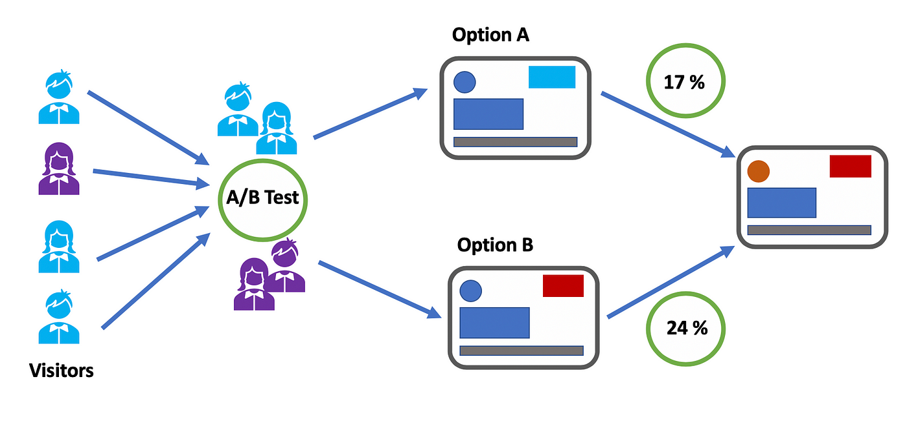

# **A/B Testing Analysis: Data-Driven Insights for Marketing Campaign Optimization**




## **Table of Contents**
1. [Introduction](#introduction)
2. [Project Overview](#project-overview)
3. [Data Description](#data-description)
4. [Data Cleaning & Preparation](#data-cleaning--preparation)
5. [Exploratory Data Analysis (EDA)](#exploratory-data-analysis-eda)
6. [Statistical Testing](#statistical-testing)
7. [Quantifying Ad Impact](#quantifying-ad-impact)
8. [Conclusions & Recommendations](#conclusions--recommendations)
9. [Usage](#usage)
10. [Visualizations](#visualizations)
11. [Acknowledgments](#acknowledgments)

## **Introduction**

In this project, I teamed up to conduct an A/B testing analysis to evaluate the effectiveness of a marketing ad campaign. The goal was to:
1. Assess whether the ad campaign significantly impacted user conversions.
2. Quantify the extent to which the success could be attributed to ad exposure.

**Key Objectives:**
- Analyze user behavior based on exposure to ads versus public service announcements (PSAs).
- Identify trends in conversion rates.
- Provide actionable insights for optimizing future marketing strategies.

---

## **Project Overview**

1. **Data Cleaning** – Addressing missing values, duplicate removal, and data type standardization.
2. **Exploratory Data Analysis (EDA)** – Analyzing individual variables and relationships to uncover trends.
3. **Statistical Testing** – Using chi-squared tests, Fisher's Exact Test, and logistic regression to assess the impact of ads on conversions.
4. **Quantifying Ad Impact** – Calculating key metrics like Absolute Risk Reduction (ARR) and Relative Risk (RR) to measure campaign effectiveness.
5. **Conclusions & Recommendations** – Providing data-driven strategies for marketing optimization.

---

## **Data Description**

The dataset contains 588,101 records with six key variables. Below is a brief data dictionary:

| Variable | Description |
|----------|-------------|
| `user id` | Unique identifier for each user |
| `test group` | 'ad' if exposed to ads, 'psa' for public service announcements |
| `converted` | `True` if the user bought the product, `False` otherwise |
| `total ads` | Number of ads viewed by the user |
| `most ads day` | Day of the week with the highest ad exposure |
| `most ads hour` | Hour of the day with the highest ad exposure |

### **Sample Data Preview**
```plaintext
| user id | test group | converted | total ads | most ads day | most ads hour |
|---------|------------|-----------|-----------|--------------|---------------|
| 12345   | ad         | True      | 15        | Tuesday      | 18            |
| 67890   | psa        | False     | 5         | Thursday     | 20            |
```

---

## **Data Cleaning & Preparation**

**Steps Taken:**
- **Missing Values:** No missing values were found in the dataset.
- **Duplicates:** Verified and removed duplicate `user id`s to ensure data integrity.
- **Data Type Standardization:** Converted columns to appropriate data types (e.g., categorical for `test group`).
- **Column Removal:** Dropped irrelevant columns like `Unnamed: 0`.

*In this step, I ensured the dataset was ready for accurate analysis by addressing potential data quality issues.*

---

## **Exploratory Data Analysis (EDA)**

### **Univariate Analysis**
- **Objective:** To understand the distribution of individual variables.
- **Key Findings:**
  - **`test group` distribution:** Majority of users were in the 'ad' group (94%).
  - **`converted`:** The overall conversion rate was higher in the 'ad' group (2.5%) than in the 'psa' group (1.7%).
  - **`total ads`:** Distribution was positively skewed, with some users being heavily exposed to ads.


*Bar chart showing the distribution of the `test group` variable, highlighting the imbalance between the 'ad' and 'psa' groups.*

### **Bivariate Analysis**
- **Objective:** Explore relationships between variables to identify patterns.
- **Key Findings:**
  - **Conversion Rates:** Higher in the 'ad' group compared to the 'psa' group.
  - **Total Ads vs. Conversion:** Users who converted typically saw more ads.
  


*Bar chart comparing conversion rates between the 'ad' and 'psa' groups.*


*Box plot showing the distribution of `total ads` for converted versus non-converted users.*

---

## **Statistical Testing**

### **Hypotheses**
- **Hypothesis 1:** There is a significant difference in conversion rates between the 'ad' and 'psa' groups.
- **Hypothesis 2:** The number of ads viewed has a significant effect on conversion.

### **Tests Conducted**
1. **Chi-Squared Test** – Showed a statistically significant difference in conversion rates between groups (p-value < 0.05).
2. **Fisher's Exact Test** – Confirmed the significance with an odds ratio of 0.693 (p-value ≈ 1.05e-14).
3. **Logistic Regression** – Quantified the impact, indicating users in the 'ad' group were 1.48 times more likely to convert.

<!-- Placeholder for statistical test results table -->


---

## **Quantifying Ad Impact**

### **Metrics Calculated**
- **Absolute Risk Reduction (ARR):** 0.77% – Indicates the absolute increase in conversion due to ads.
- **Relative Risk (RR):** 1.431 – Users in the ad group are 43.1% more likely to convert.
- **Number Needed to Treat (NNT):** 130 – Number of users needed to expose to ads to achieve one additional conversion.
- **Attributable Risk Percent:** 30.11% – Percentage of conversions in the 'ad' group attributable to the ads.

---

## **Conclusions & Recommendations**

### **Key Findings**
- The ad campaign significantly increased conversion rates compared to the control group.
- Optimal days for ad placement were identified as Tuesday and Saturday, with peak conversion during evening hours.

### **Actionable Insights**
1. **Expand Ad Exposure:** Increase ad placements, focusing on high-conversion days and times.
2. **Optimize Scheduling:** Target ad delivery during identified peak hours for maximum impact.
3. **Future Analysis:** Further segmentation can help identify user groups most responsive to ads.

---


